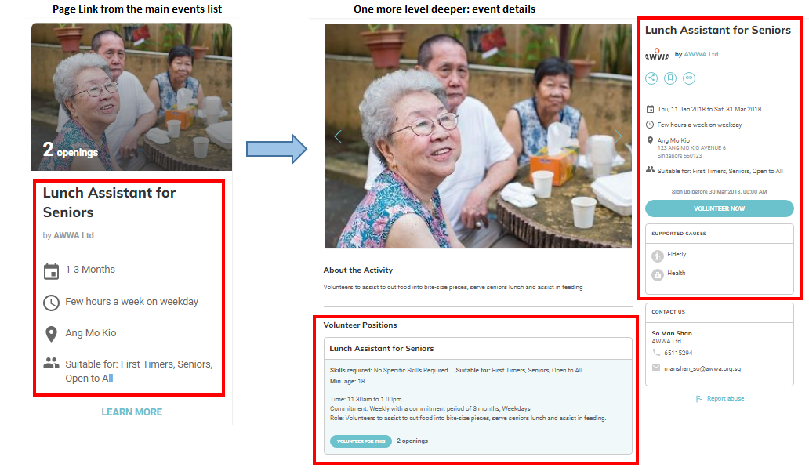

# Volunteer Matching
### Dated: 10 March 2018
### Authors:
- [Tan Ren Jie](https://github.com/notha99y/)
- [Cai Yu Tian](https://github.com/Yutian-KE)
- [Shahril Mustafa](https://github.com/RefShah)
- Kevin Yeo
- Lim Hui Juin

### Credits:
We owe our knowledge elicitation to the following domain experts:
- Ms. Saw Min Hsian
- Mrs. Joyce Tan
- Mr. Adrian Ng
- Charles Fong
- Mr. Jim
- Ms Adelina Kuan

# Introduction
In this repo, you will find code to a platform that provides recommendations of volunteering events
based on the user’s preferences.  
The platform is essentially an expert system that takes in the key preferences from the user
and then recommends a ranked list of VWO and their events.  

The matching engine is written using a rule based programming language (CLIPS) [4], which allow weighted
rankings recommendation instead of filter system that we find in most websites.

# Dependency Diagram

# Inference Structure Diagram

# Data Accquisition Pipeline
  

# Certainty Factor
We use the certainty factor (CF) method [9]to calculate the weightage of a recommendation.
For example, if a volunteer prefers to go for an event in Central. The CF will be modelled as such:
- Central: CF = 100%, North: CF = 70%, South: CF = 70%, East: CF = 0%, West: CF = 0%.

## User guide
VMatch is an expert system that recommends suitable volunteering events with respect to a set of given user
inputs characterizing the volunteer. The rules are designed through iterations of knowledge elicitation from
interviews with domain experts, VWOs and volunteers, surveys and web scraping. The rules are then modelled
and built using C Language Integrated Production System (CLIPS) which uses the Rete Algorithm to carry out
the rule firing. This summarizes what is going on under the hood. VMatch.exe is the executable file which
would open a simple and intuitive Graphic User Interface (GUI) which is decomposed into two main
components: user inputs (top-half) and recommended events (bottom-half). As the GUI was written in C#
and compiled into an exe. file, our mac friends would unfortunately not be able to open it. However, there are
many ways to go around that: dual boot, virtual machine, using WINE etc..

### How to run
1. Clone this repo to your local machine
2. Go to the ‘C:\’ directory and create a new folder called ‘VMatch’
3. Copy the contents of the Release folder into ‘C:\VMatch’
4. Double click on the VMatch.exe

### GUI
This would launch the VMatch GUI as shown below. In the User Inputs area, you can click on
the drop down boxes to choose the attributes of the volunteer you wish to model. By default, the volunteer
model would have no preference and the Recommended Events area would show the events and their
respective recommendation weights for a volunteer with no preference. A reset button is there to restart
your volunteer model to the default.

### Description of the attributes
- Age Group: Volunteer’s age
- Day Available: Volunteer’s preferred availability of the week
- Primary Skill: Volunteer’s skill that is able to value-add the event. The options are chosen from the
requirements of the events available
- My Group Size: The number of friends the volunteer would want to attend the event with
- Duration: The time in which the volunteer is able to commit for the event in a given day
- Frequency: How frequent is the volunteer able to commit his/her time
- Causes: What is the cause in which the volunteer stand for
- Area: Volunteer’s preferred area for the event to be held in

### Demo
#### Case 1: Default

#### Case 2:
  

# References
[1] NATIONAL VOLUNTEER & PHILANTHROPY CENTRE, "Individual Giving Survey 2016 Findings,"
15 March 2017. [Online]. Available: https://www.nvpc.org.sg/resources/individual-giving-survey-2016-
findings. [Accessed 22 Febuary 2018].  
[2] Ministry of Culture, Community and Youth, Charities Unit, "Commissioner of Charities Annual Report,"
August 2017. [Online]. Available:
https://www.charities.gov.sg/Publications/Documents/Commissioner%20of%20Charities%20Annual%20R
eport%202016.pdf. [Accessed 22 Febuary 2018].  
[3] National Volunteer & Philanthropy Centre (NVPC), "giving.sg," [Online]. Available:
https://www.giving.sg/search?type=volunteer. [Accessed 23 Feburary 2018].  
[4] G. Riley, "About CLIPS," [Online]. Available: http://www.clipsrules.net/?q=AboutCLIPS. [Accessed 23
Feburary 2018].  
[5] Singapore Ministry of Social and Family Development (MSF) , "Voluntary Welfare Organisations," 20
December 2016. [Online]. Available: https://www.msf.gov.sg/policies/Voluntary-Welfare-
Organisations/Pages/default.aspx. [Accessed 23 Feburary 2018].  
[6] Ministry of Culture, Community and Youth, "About Charities And IPCs," 11 January 2016. [Online].
Available: https://www.charities.gov.sg/setting-up-a-charity/Pages/About-Charities-And-IPCs.aspx.
[Accessed 3 March 2018].  
[7] HOPE worldwide (Singapore), "About Us ( HOPE worldwide (Singapore))," 2015. [Online]. Available:
https://www.hopewwsea.org/who-we-are/. [Accessed 3 March 2018].  
[8] C. P. Team, "Matching Volunteers with Voluntary Welfare Organisations," 10 Febuary 2018. [Online].
Available:
https://docs.google.com/forms/d/e/1FAIpQLSf6jNdjbOMw0M0qcSPEUduDpOUYCodo_bJfqRqAjtx9ox
lNzQ/viewform.  
[9] R. 0. D. BRUCE G. BUCHANAN, "Principles of Rule-Based Expert Systems," New York: Academic Press,
Advances in Computers, Vol.22, 1982.  
[10] Microsoft Developer Network, "Implementing the MVVM Pattern," Microsoft, [Online]. Available:
https://msdn.microsoft.com/en-us/library/gg405484(v=pandp.40).aspx. [Accessed 23 Feburary 2018].
